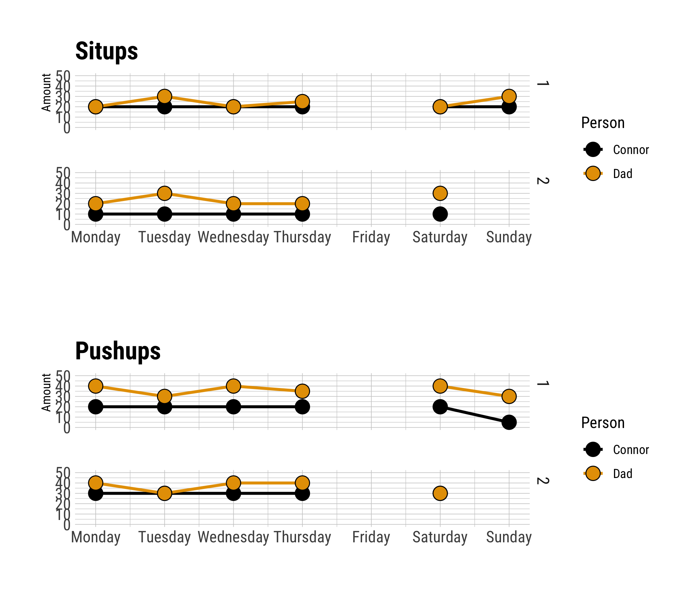

```{r setup, include=FALSE}
knitr::opts_chunk$set(echo = TRUE)
library(drake)
loadd(make_tidy)
readd(make_visualize)

```

```{r, echo=FALSE}

clean_data <- read_rds("output/clean_data_active_60.rds")

startdate <- min(clean_data$start_date)

```


We started working out on ```r glue::glue("{startdate}")```.

## Pushups & Situps

See how many situps and pushups we've done!

```{r, echo=FALSE}

connor <- clean_data %>% group_by(person) %>% filter(person=="Connor", activity=="Pushups") %>% tally(amount) %>% pull(n)

ryan <- clean_data %>% group_by(person) %>% filter(person=="Dad", activity=="Pushups") %>% tally(amount) %>% pull(n)

connor_md <- md_bold(glue::glue("Connor has done a total of {connor} pushups!"))
ryan_md <- md_bold(glue::glue("Ryan has done a total of {ryan} pushups!"))


```

`r md_bullet(connor_md)`
`r md_bullet(ryan_md)`

### Figure of Situps & Pushups

Check out this plot:

```{r, echo=FALSE, fig.cap="So many situps and pushups!"}

```

